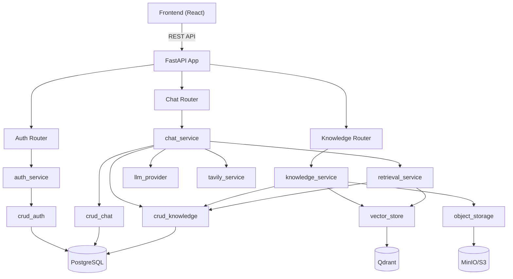

# 🔍 Dominic Backend — Comprehensive Review

## Tổng quan kiến trúc hiện tại



**Stack**: FastAPI + SQLAlchemy + LiteLLM + Qdrant + MinIO + PostgreSQL/MySQL  
**Modules**: 3 API routers, 9 services, 3 CRUD layers, 2 model files, 3 schema files

---

## ❌ Thiếu — Missing Features & Capabilities

### 1. Streaming Response (CRITICAL)
> [!CAUTION]
> Chat API hiện tại là **synchronous** — `POST /api/chat/` trả về toàn bộ response một lần. Với model lớn (Claude Opus, GPT-5.4), thời gian chờ có thể **30-120 giây**.

- Không có SSE (Server-Sent Events) hoặc WebSocket
- Frontend phải chờ toàn bộ response → UX rất kém
- Timeout risk cao khi response dài

**Cần thêm**: `POST /api/chat/stream` endpoint dùng `StreamingResponse` + SSE

---

### 2. Rate Limiting Middleware
> [!WARNING]
> Không có rate limiting ở application level — chỉ có token quota per user.

- Không giới hạn request/giây cho unauthenticated endpoints (`/api/auth/login`, `/api/auth/register`)
- Brute-force login attack hoàn toàn có thể
- Document upload không giới hạn tần suất

**Cần thêm**: `slowapi` hoặc custom rate-limit middleware

---

### 3. Token Refresh / Rotation
> [!WARNING]
> JWT token có TTL 7 ngày (`AUTH_ACCESS_TOKEN_EXPIRE_MINUTES = 10080`) nhưng **không có refresh token mechanism**.

- User phải login lại sau 7 ngày
- Không có cách revoke token đã phát (logout chỉ xóa ở client)
- Token bị leak không thể thu hồi

**Cần thêm**: Refresh token flow + token blacklist/revocation

---

### 4. Pagination cho Messages
- `GET /sessions/{id}/messages` trả về **toàn bộ tin nhắn** của session
- Session dài sẽ trả response rất lớn (100+ messages × rich metadata)
- Không có `skip/limit` parameter

**Cần thêm**: `skip`, `limit`, `before_id` parameters cho message history

---

### 5. Unit Tests / Integration Tests
> [!IMPORTANT]
> **0 test files** trong toàn bộ project. Không có `tests/` directory.

- Không có test cho CRUD operations
- Không có test cho business logic phức tạp (evidence grading, answer guardrails)
- Không có test cho authentication flow
- Không có CI test pipeline

---

### 6. Input Sanitization & Validation thiếu sót
- `ChatRequest.message` không giới hạn length → có thể gửi message **vô hạn ký tự**
- `username` validation chỉ dùng `strip()` — không chặn special chars, SQL injection patterns
- Không validate `images` data-URI format (có thể gửi arbitrary data)

---

### 7. Logging Structure
- Logging tập trung vào `uvicorn.error` logger — mất structured context
- Không có correlation ID xuyên suốt request lifecycle (chỉ có `request_id` ở một vài chỗ)
- Không log audit cho auth actions (login, register, change-password)

---

### 8. Background Job Management
- Background tasks dùng FastAPI `BackgroundTasks` — không persist, không retry sau server restart
- Không có dead letter queue cho failed ingestion jobs
- Không có job cleanup/expiration cho stuck `processing` jobs

**Cần xem xét**: Celery, ARQ, hoặc ít nhất là cleanup cron cho stuck jobs

---

### 9. Database Migration Validation
- Alembic migrations tồn tại nhưng không có check migration khi startup
- `startup.sh` có thể chạy migration nhưng không verify schema consistency

---

### 10. API Versioning
- Tất cả endpoints nằm ở `/api/*` — không có version prefix `/api/v1/*`
- Breaking changes sẽ ảnh hưởng toàn bộ client

---

## 🔴 Lỗi & Vấn đề nghiêm trọng

### 1. Hardcoded Admin Username
```python
# crud_auth.py:18
HARDCODED_ADMIN_USERNAME = "test_user"
```
> [!CAUTION]
> Admin role được hardcode cho username `"test_user"`. Bất kỳ ai register username này sẽ tự động thành admin. `set_user_role()` cũng **bị override** — không thể set admin cho user khác.

[crud_auth.py:186](file:///c:/Users/Admin/Documents/GitHub/DominicBE/app/crud/crud_auth.py#L183-L189) — `set_user_role` luôn set lại theo hardcode:
```python
def set_user_role(db, user, role):
    user.role = "admin" if _is_hardcoded_admin_username(user.username) else "user"
    # ^ role parameter bị IGNORE hoàn toàn cho non-hardcoded users!
```

---

### 2. Rename Session bị Disable hoàn toàn
```python
# chat_service.py:265
def rename_session(db, username, session_id, title):
    raise PermissionError("Manual chat renaming is disabled.")
```
- Frontend vẫn gọi `renameSession()` → luôn nhận 403
- Endpoint `PATCH /sessions/{id}` tồn tại nhưng **không hoạt động**
- Nên xóa endpoint hoặc enable lại feature

---

### 3. `datetime.utcnow()` Deprecated
```python
# crud_auth.py:150
user.reset_token_expires_at = datetime.utcnow() + timedelta(minutes=expire_minutes)
# crud_auth.py:165
if user.reset_token_expires_at and user.reset_token_expires_at < datetime.utcnow():
```
`datetime.utcnow()` đã deprecated từ Python 3.12. Nên dùng `datetime.now(UTC)` (đã dùng ở `security.py` nhưng không consistent).

---

### 4. Frontend-Backend Schema Mismatch
- Frontend `authApi.js` gửi `confirm_password` trong register, `confirm_new_password` trong change-password
- Backend `RegisterRequest` có `confirm_password` ✅ nhưng `ChangePasswordRequest` có `confirm_new_password` ✅
- Tuy nhiên, `ConsumeResetTokenRequest` cũng có `confirm_new_password` — cần verify FE gửi đúng

---

## 🟡 Thừa — Redundant / Dead Code

### 1. Temporary Files ở Root Directory
```
.tmp_backfill_validation.py
.tmp_health_direct.py
.tmp_health_exact.py
.tmp_health_validation.py
.tmp_json_validation.py
.tmp_psycopg_output.txt
.tmp_search.ps1
.tmp_validation_run.py
migration_mysql_to_postgres_run.log
migration_run.log
```
**7 file `.tmp_*` và 2 migration log** nằm ở root — nên xóa hoặc gitignore.

---

### 2. Duplicate Endpoints Pattern
Nhiều endpoint có phiên bản "me" và "by username" nhưng logic giống hệt:

| "Me" Endpoint | "Username" Endpoint | Redundant? |
|---|---|---|
| `GET /usage/me` | `GET /usage/{username}` | ⚠️ Gần như giống nhau |
| `GET /sessions` | `GET /sessions/{username}` | ⚠️ Gần như giống nhau |
| `GET /sessions/{id}/messages` | `GET /sessions/{username}/{id}/messages` | ⚠️ Gần như giống nhau |

`_assert_same_user()` chỉ cho phép user truy cập data của chính mình → các endpoint `{username}` **không thêm giá trị** so với "me" endpoints.

---

### 3. `image_payload_json` Column Overloaded
[chat_models.py:30](file:///c:/Users/Admin/Documents/GitHub/DominicBE/app/models/chat_models.py#L30) — Column `image_payload_json` chứa cả:
- Images
- Documents (attachments)
- Sources (web citations)
- Assistant metadata (model name, reasoning effort)

Tất cả packed trong 1 JSON column → khó query, khó maintain, khó extend.

---

### 4. `CitationSource` Schema Duplicate
- `chat_schemas.py` có `CitationSource` class
- `knowledge_schemas.py` cũng có `CitationSource` class (khác fields)
- Dễ confuse khi import

---

### 5. Prompt Caching No-Op
```python
# llm_provider.py:495-501
def _apply_prompt_caching(call_messages, system, model_str):
    del model_str
    return call_messages, system
```
Function này là **no-op hoàn toàn** nhưng vẫn được gọi mỗi request. Config `LLM_PROMPT_CACHING_ENABLED` và `LLM_PROMPT_CACHING_MIN_CHARS` tồn tại nhưng không có tác dụng.

---

## 🟢 Cần cải thiện — Improvements

### 1. Error Handling quá generic
```python
except Exception as e:
    raise HTTPException(status_code=500, detail=str(e))
```
Pattern này xuất hiện ở **hầu hết endpoint** — leak internal error messages (stack trace, DB errors, file paths) ra client. Nên:
- Log full error internally
- Return generic user-facing message
- Differentiate error types

---

### 2. `chat_service.py` quá lớn (1286 lines)
File này chứa:
- Session management
- Message history building
- Retrieval orchestration
- Answer guardrails
- Web source formatting
- Auto-titling logic
- Summary compression
- Token estimation

**Nên tách thành**: `session_service.py`, `answer_guardrails.py`, `context_builder.py`

---

### 3. Database Connection Pool không có `pool_size`
```python
# database.py:29
engine = create_engine(
    settings.sqlalchemy_database_url,
    pool_pre_ping=True,
    pool_recycle=300,
    pool_timeout=10,
    # Missing: pool_size, max_overflow
)
```
Dùng SQLAlchemy default (`pool_size=5`, `max_overflow=10`) — có thể không đủ cho production.

---

### 4. Knowledge Service thiếu Duplicate Detection
- Upload cùng file 2 lần → tạo 2 document records
- Có `checksum` column nhưng **không check trùng** trước khi ingest
- Nên warn user hoặc skip nếu checksum trùng

---

### 5. CORS quá rộng trong Regex
```python
allow_origin_regex=r"^https?://(localhost|127\.0\.0\.1)(:\d+)?$|^https://.*\.azurestaticapps\.net$"
```
Regex cho phép **bất kỳ subdomain** của `azurestaticapps.net` — nếu attacker tạo app trên Azure Static Web Apps, có thể CORS bypass.

---

### 6. Synchronous DB Operations trong Async Context
- `upload_document` endpoint là `async def` nhưng tất cả DB operations bên trong đều **synchronous**
- SQLAlchemy `Session` đang dùng sync engine
- Có thể block event loop khi DB chậm

---

### 7. Thiếu OpenAPI Documentation
- Không có `description` cho hầu hết endpoints
- Không có `response_model` examples
- Không có API docs page customization
- `/docs` page functional nhưng thiếu context

---

## 📊 Tóm tắt đánh giá

| Category | Status | Priority |
|---|---|---|
| **Streaming Response** | ❌ Missing | 🔴 Critical |
| **Rate Limiting** | ❌ Missing | 🔴 Critical |
| **Hardcoded Admin** | 🔴 Security Bug | 🔴 Critical |
| **Unit Tests** | ❌ Missing | 🔴 High |
| **Token Refresh** | ❌ Missing | 🟡 High |
| **Message Pagination** | ❌ Missing | 🟡 High |
| **Input Validation** | ⚠️ Incomplete | 🟡 High |
| **Rename Session** | 🔴 Broken | 🟡 Medium |
| **Temp Files Cleanup** | ⚠️ Messy | 🟢 Low |
| **Duplicate Endpoints** | ⚠️ Redundant | 🟢 Low |
| **Service Decomposition** | ⚠️ Monolithic | 🟡 Medium |
| **Error Message Leak** | ⚠️ Security Risk | 🟡 High |
| **Duplicate Document Detection** | ❌ Missing | 🟢 Medium |
| **API Versioning** | ❌ Missing | 🟢 Low |
| **DB Pool Config** | ⚠️ Default | 🟡 Medium |
| **Background Job Resilience** | ⚠️ Fragile | 🟡 Medium |

---

## 🏆 Điểm mạnh hiện tại

Dù có nhiều thiếu sót, backend cũng có nhiều điểm đã làm tốt:

1. **RAG Pipeline hoàn chỉnh**: Hybrid retrieval (semantic + lexical) với reranking, query expansion, evidence grading, answer guardrails — rất mature
2. **Prometheus Metrics**: Observability middleware với counter, histogram, gauge
3. **Health Checks**: Granular health endpoints cho từng dependency (Postgres, MinIO, Qdrant)
4. **Audit Logging**: Immutable audit trail cho knowledge operations
5. **Image Processing Pipeline**: OCR fallback, resize, format conversion — tiết kiệm token
6. **Soft Delete**: Document deletion có soft-delete + admin hard-delete
7. **Multi-model Support**: Flexible LLM provider layer hỗ trợ 13+ models
8. **Web Search Integration**: Tavily với intelligent query planning
9. **Context Compression**: Auto-summary cho long conversations
10. **Per-session Knowledge**: Documents scoped to specific chat sessions
